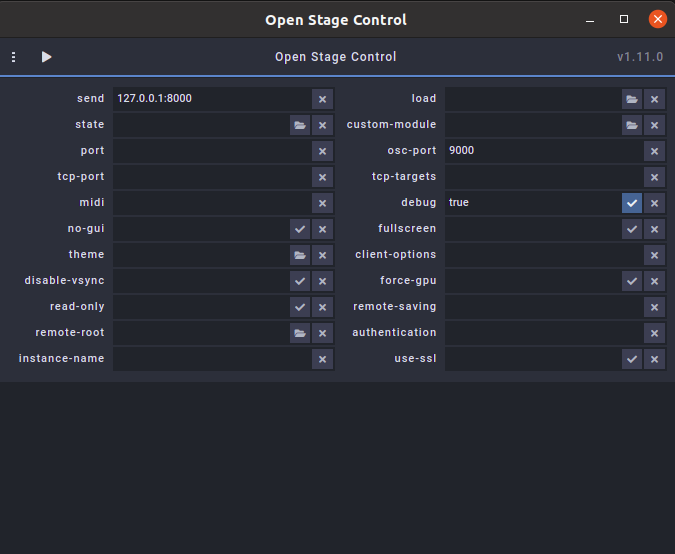
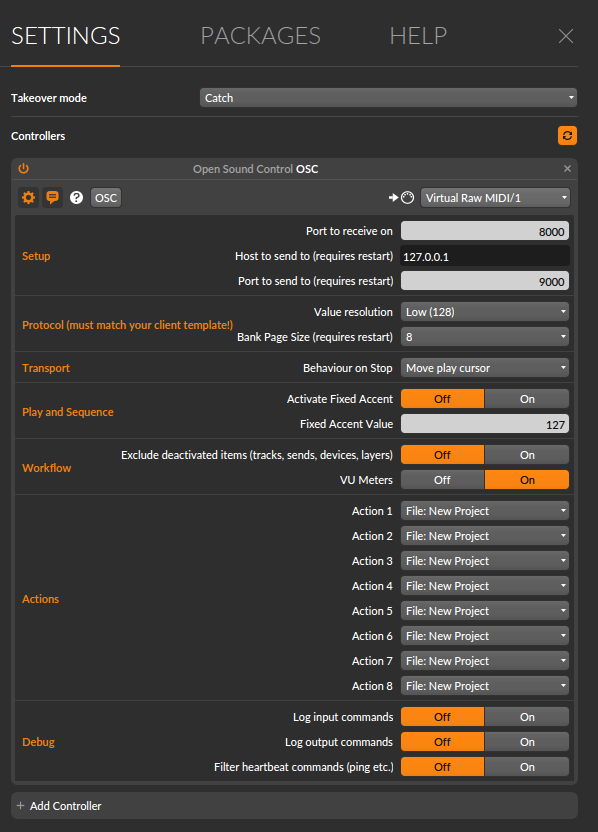
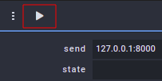
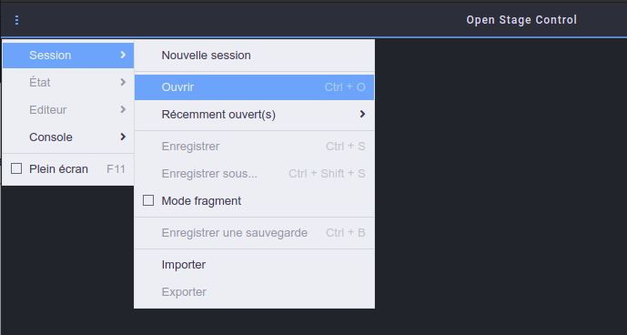
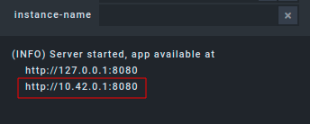
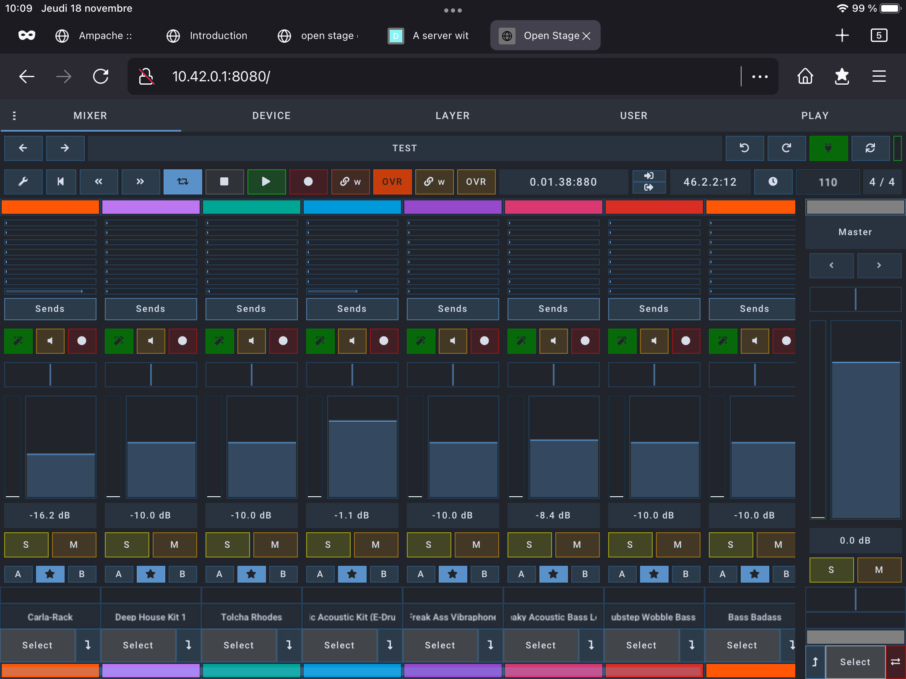
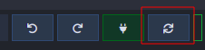

# Open Stage Control Bitwig - Client - Host

> Done with ubuntu and an iPad

## Definitions
- Host: computer hosting Bitwig and Open Sound Control app
- Client: your tablet / computer that will send messages to the host

## Steps

This are the steps I followed to make it work

### Install Driven By Moss bitwig extension 

> Pay attention to the extension version according to your current Bitwig version

- Download [Driven by Moss bitwig extension](http://www.mossgrabers.de/Software/Bitwig/Bitwig.html) 
- Unzip the downloaded archive somewhere (just remember where)
- Copy `extrectedFolder/DrivenByMoss.bwextension` in your `{USERHOME}/Bitwig Studio/Extensions/` folder

### Install and configure Open Stage Control

- Download [Open Stage Control](https://openstagecontrol.ammd.net/) and install it on your host
- Launch Open Stage Control and configure it as shown below

### Make a wifi hotspot

Your host and client need to be on the same network so create a wifi hotspot in your computer and connect your client to this hotspot

> I think this is not mandatory, you could just be connected to the same wifi network... but then you'd probably have to open your internet router to let your client enter and you'd probably face latency issues...

### Add a controller in Bitwig 

- Add an Open Sound Control controller in bitwig and leave the default configuration

> You must select a midi device... on my computer I just enable Alsa Virtual MIDI (`modprobe snd-virmidi`) and select one of the virtual device

### Here we go

- Launch Open Stage Control server by hiting the "play" button

- Open Driven by Moss OSC template (it should be in Driven by Moss extracted folder for instance `~/Downloads/DrivenByMoss-x.x.x-Bitwig/resources/OSC/OpenStageControl4Bitwig.json`)

- With debug enabled you'll see some IP:PORT appearing in console, one of them is the one you should use to connect your client to the host 

- Open a webbrowser in your client (I used Firefox in my iPad) and enter the adress and Tada !

- You might need to refresh the host / client connection just use the button shown below

## Side notes

- I provided my Open Stage Control config (`osc-app-default.config`)
- You should be able to set the template to load in Open Stage Control config
- Both Jürgen Moßgraber work regarding Bitwig extension and Jean-Emmanuel's one regarding Open Stage Control are fantastic :sparkles: :clap: :sparkles:
